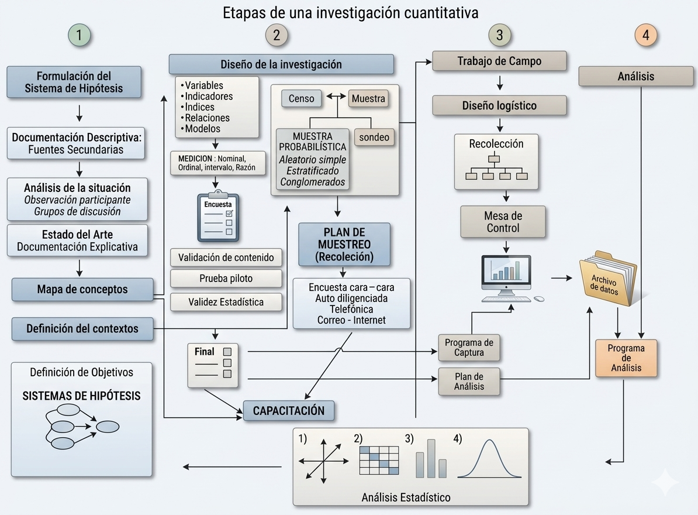
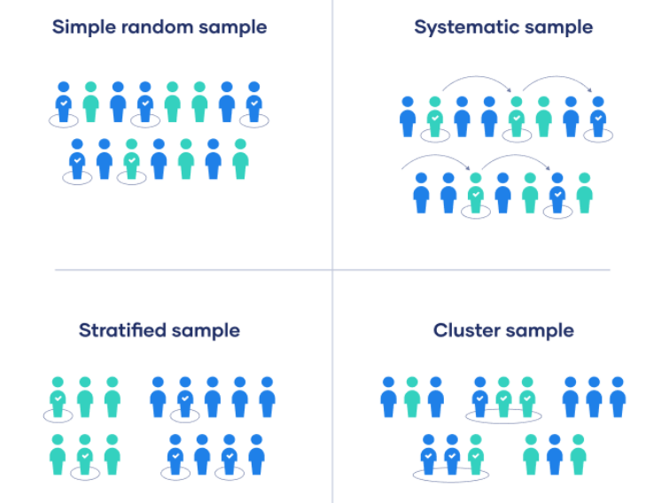
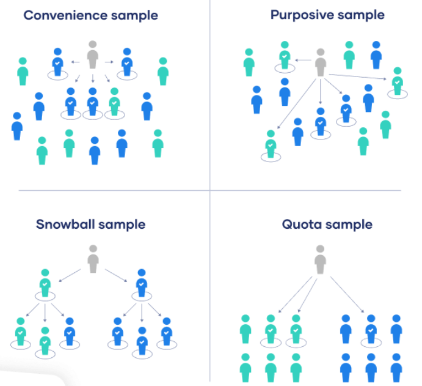

# INTRODUCCIÓN {background-color="#0077b6"}

## 0. Operación estadística

::: {.clave}
Es la aplicación del conjunto de procesos y actividades que comprende la identificación de necesidades, diseño, construcción, recolección o acopio, procesamiento, análisis, difusión y evaluación, la cual conduce a la producción de información estadística sobre un tema de interés nacional o territorial.
:::

--- 

{fig-align="center" width="78%"}

---

## Estrategia de muestreo

```{r,  out.width= '110%'}
knitr::include_graphics(here::here("images/Esquema1.png"))
```

## Discusión

Discutamos los siguientes conceptos por 5 minutos:

- Aleatoriedad
- Variable aleatoria
- Población
- Muestra
- Incertidumbre
- Confiabilidad

```{r}
library(countdown)
countdown(minutes = 5, seconds = 00,  right = 0)

# countdown(minutes = 1, seconds = 30,
#           left = 0, right = 0,
#           padding = "50px",
#           margin = "5%",
#           font_size = "6em")
```

## Decisiones previas al muestreo

- Propósito del estudio
- Población de interés
- Disponibilidad de bases de datos
- Instrumentos de medición
- Tipo de levantamiento de información
- Prueba piloto

---

## Conceptos básicos

<br>

<div style="text-align: justify;">

**Universo ideal**: Se trata del conjunto sobre el cual el investigador y no propiamente el muestrista pretende obtener algún tipo de información. <span style="color:#FF8D21"> Definir Alcance: Ej. Intención de voto - ¿Rural?</span>

<br>

**Población Objetivo**: Constituye el conjunto de elementos que partiendo del universo ideal pueden ser realmente alcanzados por la investigación. Lo anterior se puede dar por razones operativas, políticas, económicas, etc.

</div>

## Conceptos básicos

<br>

<div style="text-align: justify;">

**Marco Muestral**: Dispositivo que permite  <span style="color:#FF8D21"> **IDENTIFICAR y UBICAR** </span> a todos los elementos de la población objetivo. Marcos de lista:

</div>

- Lista de estudiantes de esta clase.
- Lista de beneficiarios de un programa. 
- Listado de municipios del país. 

<span style="color:red"> **TAREA**:</span> Investigue qué es y cómo se obtiene el Marco Geoestadístico Nacional (MGN).

## Conceptos básicos

<div style="text-align: justify;">
**Operación estadística**

Es la aplicación del conjunto de procesos y actividades que comprende la identificación de necesidades, diseño, construcción, recolección o acopio, procesamiento, análisis, difusión y evaluación, la cual conduce a la producción de información estadística sobre un tema de interés nacional o territorial.

</div>

. . . 

<br>

<div style="text-align: justify;">
**Unidades estadísticas**

Entidad acerca de la que se busca información y para la que se compilan las estadísticas. Puede dividirse en las siguientes categorías: unidad de observación, unidades de análisis y unidad de muestreo.

</div>

## Conceptos básicos

- **Muestra**: subconjunto de la población.
- **Unidad de muestreo**: objeto o elemento susceptible de ser seleccionado en la muestra.
- **Unidad de observación**: objeto sobre el cual se realiza al menos una medición.
- **Elemento**: unidad individual sobre la que se realizan mediciones.
- **Conglomerado**: agrupación de elementos.
- **Error de muestreo**: imputable a la aleatoriedad de la muestra.
- **Error de no muestreo**: se produce en toda la investigación por definiciones
  conceptuales incorrectas, fallos en los instrumentos de medida, en la
  entrevista o en el trabajo de campo.

## Definiciones: variables de interés

- ¿Qué es una variable?: $y_k$, $z_k$, $x_k$.

- Parámetros a investigar: totales, razones, proporciones, indicadores,
  índices. Por ejemplo: total de víctimas del conflicto armado,
  proporción de personas que votarán por determinado candidato, tasa de desempleo.

---

## Tu turno

<br><br>

Identifique:

- Universo
- Muestra
- Unidades estadísticas
- Variables
- Parámetros de interés


## Ejemplo 1: Clima escolar


<div style="text-align: justify;">

<br><br>

La SED realizó una investigación en los colegios oficiales de la ciudad de Bogotá D.C. con el fin de medir el clima escolar de las instituciones, para ello usó una muestra de 658 sedes educativas, en las cuales se seleccionaron estudiantes de los grados 3°, 5°, 7° y 9° para aplicar un instrumento donde se indagan, entre otros, los aspectos sobre el bulling, habilidades socioemocionales, nivel de satisfacción con la sede educativa. 

</div>

## Ejemplo 2: Intención de voto


<div style="text-align: justify;">

Una campaña política para la Presidencia de la República realizó una investigación para establecer las estrategias a seguir. Para ello se dividió al país en 7 regiones, y dentro de cada una se dividieron los municipios en tres tipos: grandes, medianos y pequeños. Dentro de cada tipo se seleccionó una muestra de municipios, dentro de los municipios seleccionados se usó el MGN para seleccionar segmentos, hogares y finalmente personas. La muestra consideró a 6430 personas con edad para votar en 89 municipios, los cuales respondieron por el conocimiento de los candidatos, la intención de voto y los aspectos que consideran que actualmente son los principales problemas del país.  

</div>

## Tipos de muestreo

Existen dos grandes categorías de métodos de muestreo.

::: {.definicion}
[Muestreo probabilístico.]{.callout-label} Todos los elementos de la
población objetivo tienen una probabilidad **conocida** a priori de ser
seleccionados, y al momento de la selección se aplica un algoritmo
aleatorio que garantiza que dichas probabilidades se cumplan. Su fortaleza
radica en la posibilidad de generalizar a toda la población; generalmente
son muestras costosas.

[Muestreo NO probabilístico.]{.callout-label} Todas las demás muestras,
donde el investigador puede influenciar la selección, o donde —debido a la
inexistencia de un marco muestral o a una población de difícil consecución—
no es posible conocer las probabilidades a priori. No permite hacer
inferencia hacia la población; es de bajo costo y fácil aplicación.
:::

## Tipos de muestreo

Existen dos grandes categorías de métodos de muestreo

::: columns
::: {.column width="60%"}

::: {.incremental}

<div style="text-align: justify;">

<span style="font-size:22pt">**Muestreo probabilístico:** Implica que todos los elementos de una población objetivo tienen una probabilidad CONOCIDA  a priori de ser seleccionados y que al momento de la selección se aplica un algoritmo aleatorio que garantiza que dichas probabilidades se cumplan. Permite <span style="color:#FF8D21">**generalizar los resultados a toda la población pero son costosos**</span></span>

</div>

:::

:::

::: {.column width="40%"}


{fig-align="center" width="100%"}
<span style="font-size:8pt">**Figura:** Fuente de la imagen: [Scribbr - Sampling Methods](https://www.scribbr.com/methodology/sampling-methods/)</span>

:::

:::


## Tipos de muestreo

Existen dos grandes categorías de métodos de muestreo

::: columns
::: {.column width="60%"}

::: {.incremental}

<div style="text-align: justify;">

<span style="font-size:22pt">**Muestreo NO probabilístico:** Son todas las demás muestras donde el investigador puede influenciar la selección o debido a la inexistencia de un marco muestral o por ser un target de difícil consecución no es posible conocer las probabilidades a priori. <span style="color:#FF8D21"> **No es posible hacer inferencia a la población**, es de bajo costo y fácil aplicación.</span></span>

</div>

:::

:::

::: {.column width="40%"}

{fig-align="center" width="100%" fig-cap="Fuente: [Sampling Methods](https://conceptshacked.com/probability-sampling/)"}
<span style="font-size:8pt">**Figura:** Fuente de la imagen: [Sampling Methods](https://conceptshacked.com/probability-sampling/)</span>


:::

:::


## Tipos de muestreo


```{r}
library(pacman)
p_load(ggflowchart, ggplot2)
data <- tibble::tibble(from = c(rep("Tipos de Muestreo", 2), 
                                rep("No Probabilístico", 4),
                                rep("Probabilístico", 4)),
                       to = c("No Probabilístico", "Probabilístico", 
                              "Bola de nieve", "Conveniencia", "Juicio", "Cuotas",
                              "Estratificado", "PPT", "Bernoulli", "MAS"))
ggflowchart(data, horizontal = TRUE, 
            arrow_colour = "darkblue", colour = "black",
            text_colour = "white", fill = "blue") 
```

## Mecanismo de ponderación

Mecanismo utilizado para devolver a la muestra el peso diferencial que
tiene en la población. Generalmente se usa para ajustar una distribución
conocida a priori con la distribución observada a posteriori. Algunas se basan en:

- el diseño
- Posestratificación, *Raking*, GREG, etc.
- IPW, MI, DR.

::: {.observacion}
¿Por cuáles variables pondero? La elección de las variables de
ponderación es una decisión metodológica, no automática.
:::



