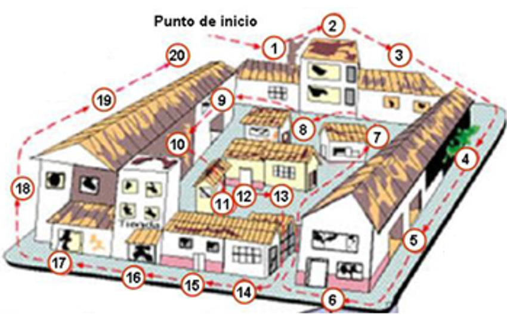
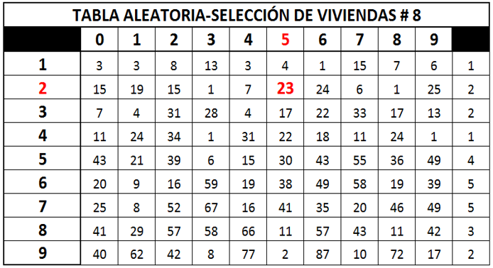

# MUESTREO PROBABILÍSTICO {background-color="#0077b6"}

## Diseño muestral

<br> 

::: {.definicion}
Sea $s \subseteq U$ una muestra probabilística, y sea $S$ el conjunto de
todas las muestras posibles. La función de medida de probabilidad
$$
\mathbf{P}: S \rightarrow (0,1), \qquad s_i \mapsto p(s_i)
$$
Dado el conjunto $S$, un **diseño de muestreo** es una función $p(\cdot)$
tal que $p(s_i)$ es la probabilidad de que la muestra $i$ sea seleccionada.
:::

## Ejemplo: Muestreo Aleatorio Simple. 

$$
p(s_i)=\begin{cases}
\dfrac{1}{\binom{N}{n}} & \text{para toda muestra de tamaño } n \text{ de } N \text{ sin reposición} \\[4pt]
0 & \text{en otro caso}
\end{cases}
$$

$n$ corresponde al tamaño de la muestra, mientras que $N$ corresponde al
tamaño del universo. Este diseño se acostumbra a denotar $MAS(N,n)$.


## Mecanismo de selección 

::: {.definicion}
[Algoritmo 1: coordinado negativo.]{.callout-label} 

1. Generar $N$ realizaciones de una variable aleatoria $\xi_k$ ($k\in U$) con distribución uniforme (0,1).
2. Asignar $\xi_k$ al elemento $k$-ésimo de la población.
3. Ordenar la lista de elementos descendente (o ascendentemente) con respecto a este número aleatorio $\xi_k$.
4. A continuación, seleccionar los $n$ primeros (o los $n$ últimos) elementos. Esta selección corresponde a la muestra realizada.

:::

::: {.tarea}
Use la DIVIPOLA y seleccione 25 municipios usando un diseño MAS y el algoritmo coordinado negativo.
:::

## Mecanismo de selección {style="font-size: 80%;"}

::: {.definicion}
[Algoritmo 2: Fan, Muller & Rezucha (1962).]{.callout-label} Denominado
método de selección-rechazo, consiste en ir descartando o seleccionando
cada elemento de la muestra:

1. Realizar $\xi_k\sim U(0,1)$
2. Calcular
\begin{equation*}
c_k=\dfrac{n-n_k}{N-k+1}
\end{equation*}
donde $n_k$ es la cantidad de objetos seleccionados en los $k-1$ ensayos anteriores.
3. Si $\xi_k<c_k$, entonces el elemento $k$ pertenece a la muestra.
4. Detener el proceso cuando $n=n_k$.
:::

[Ejemplo en Excel: Fan-Muller.]{.rojo}

[Ejercicio: Use la DIVIPOLA para seleccionar una muestra de 25 municipios, use sample(N, n, replace = FALSE) y S.SI(N, n)]{.rojo}

## Implementación

```{r}
#| echo: true
#| message: false
#| warning: false
library(pacman)
p_load(tidyverse, TeachingSampling, janitor)

url <- "https://github.com/jgbabativam/Muestreo2026/raw/main/data/"
divipola <- read.csv2(paste0(url, "DIVIPOLA.csv")) |> clean_names()

### Coordinado negativo
set.seed(123456)
divipola$zeta <- runif(nrow(divipola))

n <- 25

muestra <- divipola |> 
           arrange(zeta) |> 
           slice(1:n)

```

## Implementación

```{r}
#| echo: true
#| message: false
#| warning: false

# Fan, C.T., Muller, M.E., Rezucha, I.
set.seed(123456)
N <- nrow(divipola)
n <- 25

indices <- S.SI(N, n)
muestra2 <- divipola[indices,]

### sample R
set.seed(123456)
indices <- sample(N, n, replace = FALSE)
muestra3 <- divipola[indices,]
```

## Ejemplos: Muestreo Bernoulli. 

$$
p(s_i)=\underbrace{\pi.\pi\ldots\pi}_{n_s\ \text{veces}}
\underbrace{(1-\pi)(1-\pi)\ldots(1-\pi)}_{N-n_s\ \text{veces}}
$$

$$
p(s_i)=
\begin{cases}
\pi^{n_s}(1-\pi)^{N-n_s} & \forall s \text{ de tamaño } n_s \text{ sin reposición}\\[4pt]
0 & \text{en otro caso}
\end{cases}
$$

$\pi$ se fija a priori por experiencia y es igual para todos los elementos de $U$.
Nótese que $n_s$ es un tamaño de muestra aleatorio que puede incluir a todos o a ningún elemento en la muestra. Se acostumbra a notar como $Ber(N, \pi)$.

## Muestreo Bernoulli: Mecanismo de selección

<br>

::: {.definicion}
1. Fijar el valor de $\pi$ tal que $0<\pi<1$.
2. Asignar $\xi_k \sim U(0,1)$ para todos los elementos de $U$.
3. El elemento $k$ pertenece a la muestra si $\xi_k < \pi$. Así, la probabilidad de que el $k$-ésimo elemento pertenezca a la muestra es igual a $\pi$.
:::

[Ejemplo.]{.rojo}: Suponga una población $U: \{U_1, U_2, U_3, U_4\}$, con $\pi=0.1$. Construya $S$ y $p(s)$. `SupportRS()`.

## Ejemplos: Muestreo Sistemático. 

Cuando no se dispone de un marco de muestreo de manera explícita pero se sabe que la población está ordenada por un rótulo en particular. Por ejemplo, los hogares dentro de una manzana están ordenados por su dirección o número de apartamento.

$$
p(s_i)=
\begin{cases}
\dfrac{1}{\binom{a}{r}} & \text{con una muestra por } \{a_j,a_k\},\ r=2\ \text{elementos}\\[4pt]
0 & \text{en otro caso}
\end{cases}
$$

$N=an+r$, el tamaño de muestra se define como la parte entera del cociente $N/a$. Se nota como $SIS(N, n, r)$.

## Muestreo Sistemático:  Mecanismo de selección

::: {.definicion}
1. Seleccionar con probabilidad $\frac{1}{a}$ un arranque aleatorio. Es decir, un valor $q$ tal que $1\leq q \leq a$.
2. La muestra estará definida por el siguiente conjunto:

$$
s_q=\left\{k: k=q+(j-1)a;\ j=1, \ldots, n_s\right\}
$$
:::

## Ejemplo: Tabla aleatoria {style="font-size: 65%;"}

<div style="text-align: justify;">

La selección de viviendas en un muestreo con varias etapas suele seguir un procedimiento sistemático.

</div>

::: columns
::: {.column width="65%"}

1. A partir de un recorrido a la manzana se enumera a las viviendas ocupadas en una lista. La enumeración comienza desde el número 1 y finaliza en el número total de viviendas dentro de la unidad seleccionada

2.Cálculo del salto sistemático, se toma la parte entera de: $a = \left\lfloor \frac{N}{n} \right\rfloor$

:::

::: {.column  width="35%"}

{fig-align="right" width="80%"}

:::

:::

3. Selección de las viviendas: Ejemplo, suponga una manzana donde se encuentran 50 viviendas para seleccionar 2, como $a=25$ se busca este valor en la tabla. O con APi de números aleatorios entre 1 y $a$.

{fig-align="center" width="30%"}


4. Se visitan las viviendas numeradas con los consecutivos 23 y 48 (23+25). 


## Cierre

::: {.clave}
- Toda investigación por muestreo empieza por decisiones **conceptuales**
  (universo, marco, variables, objetivo) que anteceden cualquier fórmula.
- La estrategia muestral se divide en **probabilística** y **no
  probabilística**; solo la primera permite inferencia formal.
- Un diseño muestral es, formalmente, una función de probabilidad
  $p(\cdot)$ sobre el conjunto de todas las muestras posibles de $U$.
:::

**Próxima sesión:** probabilidades de inclusión, la indicadora $I_k$, el
$\pi$-estimador de Horvitz-Thompson y sus propiedades (Särndal, Cap. 2).


