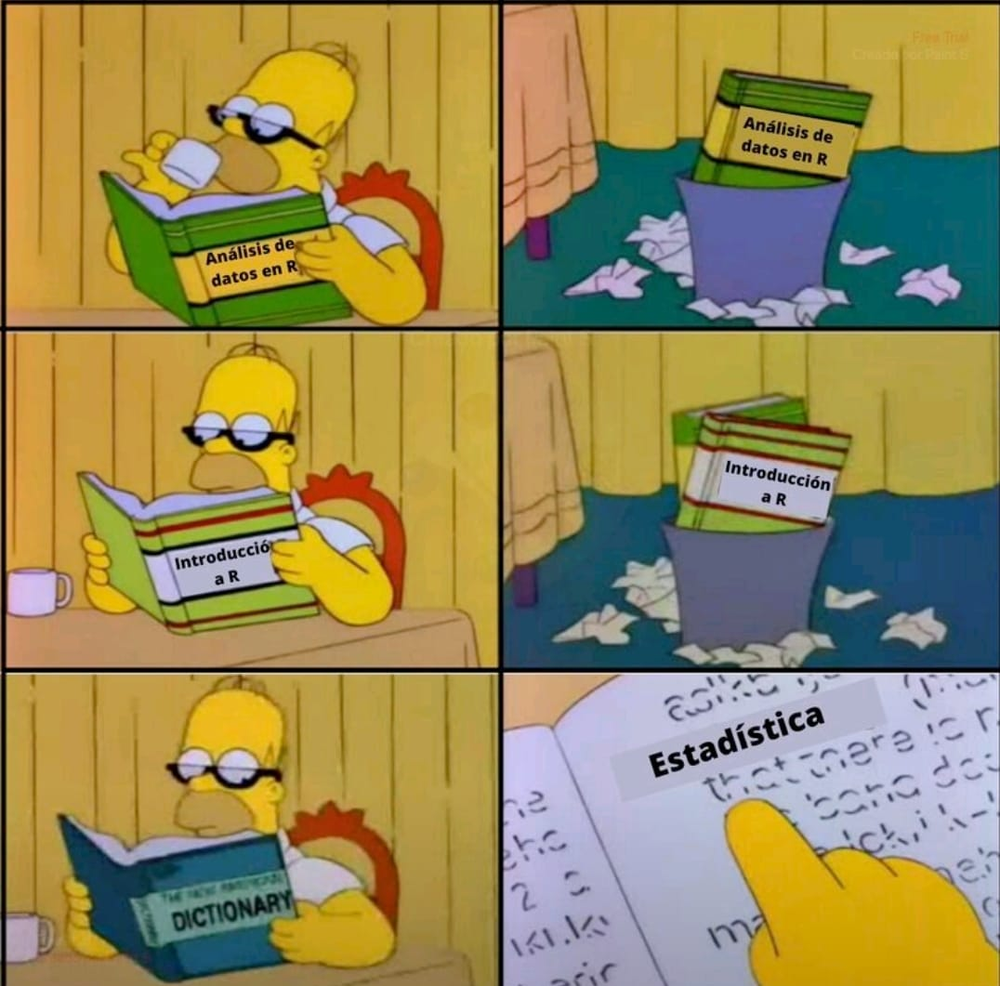
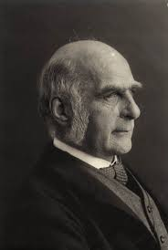
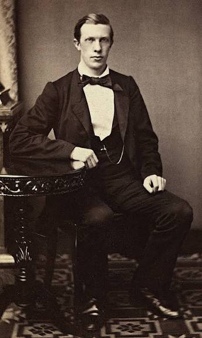
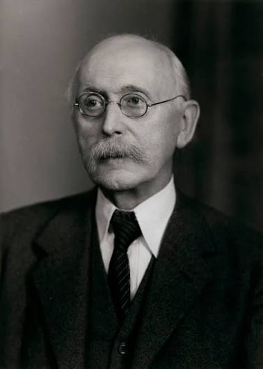
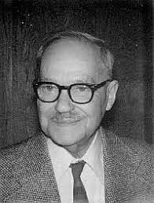
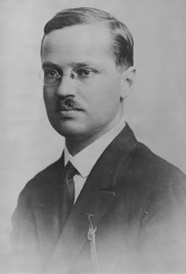
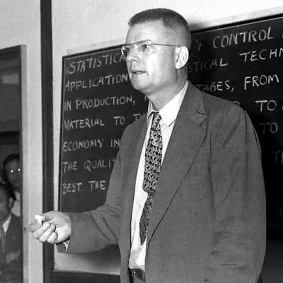
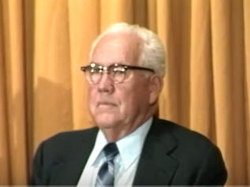

## Sobre Mi

<div style="text-align: justify;">

PhD en Estadística, MSc en Big Data, MSc en Estadística y Estadístico.  Con 25 años de experiencia profesional y docente, director de analítica en varias empresas, miembro del comité de expertos en pobreza en el DANE y consultor de la División de Estadística de la CEPAL. Ex-decano de la Facultad de Estadística USTA, ex-director de operaciones en el ICFES,...

> Puedes encontrarme en:

-  [Google scholar](https://scholar.google.es/citations?user=2NJRNg8AAAAJ&hl=es)
-  [GitHub. https://github.com/jgbabativam](https://github.com/jgbabativam)
-  [linkedin](https://www.linkedin.com/in/giovany-babativa-marquez/?originalSubdomain=co)
-  jgbabativam@unal.edu.co

</div>

---

## Presentación

</br>

- Nombres.
- Materias que tiene inscritas.
- Ya aprobó: 
  - Programación
  - Probabilidad
  - Inferencia
  
## Reglas del juego

::: columns
::: {.column width="50%"}

::: {.incremental}

* Horario: Martes y Jueves de 4:00 p.m. a 5:45 p.m.

* Mecanismo de evaluación: 
  - 3 exámenes.
  - 1 exposición pública.
  - Tareas

* Temas de exposición y grupos de trabajo.
* Bibliografía

:::

:::

::: {.column width="50%"}

<br><br>

{fig-align="center" width="100%"}

:::

:::
  

## Proceso de analítica


```{r, out.width= '100%'}
knitr::include_graphics(here::here("images/Ciclo.png"))
```
[Wickham, H. y otros (2023)](https://r4ds.hadley.nz/)


## Paquete R

::: columns
::: {.column width="50%"}

::: {.incremental}

* Paquete de uso libre

* Tiene todos los métodos que necesitamos

* Incluye paquetes específicos en muestreo como `TeachingSampling`, `samplesize4surveys`, `survey`, `srvyr`, `sampling`, etc

:::

:::

::: {.column width="50%"}

{fig-align="center" fig-alt="R logo" width="80%"}

:::

:::

## Etapas del proceso

{fig-align="center"}

## El entorno `tidyverse`

{fig-align="center"}

## Flujo de trabajo

{fig-align="center"}

# ANTECEDENTES Y JUSTIFICACIÓN {background-color="#0077b6"}

## Sir Francis Galton (1822-1911)

::: columns
::: {.column width="70%"}

::: {.incremental}

<div style="text-align: justify;">

* **Galton** hizo importantes contribuciones en muchos campos de la ciencia, incluyendo la meteorología (mapas meteorológicos), la estadística (regresión y correlación), la psicología (sinestesia), la biología (mecanismo de la herencia) y la criminología (huellas dactilares).

* Fue el primero en introducir el uso de cuestionarios y encuestas para recopilar datos sobre comunidades humanas.

</div>

:::

:::

::: {.column width="30%"}

<br>

{fig-align="center" fig-alt="R logo" width="80%"}

:::

:::

## 1897 — Kiær y el "método representativo" {style="font-size: 85%;"}

::: {.columns}
::: {.column width="35%"}
{fig-align="center" width="90%"}

::: {style="text-align:center; font-size:0.7em;"}
Anders N. Kiær (1838–1919)
:::
:::
::: {.column width="65%"}
- Fundador y primer director del Instituto de Estadística de Noruega.
- Primero en usar una encuesta por muestra en lugar de un censo completo.
- En el ISI de Berna (1895) presentó el **método representativo**: una "investigación parcial" cuidadosamente elegida para reflejar a la población en miniatura.
- Su noción de "representatividad" era subjetiva y sin base probabilística — la comunidad estadística de la época lo recibió con fuerte oposición.
:::
:::

## 1906-1926 — Bowley: aleatorización y estratificación {style="font-size: 85%;"}

::: {.columns}
::: {.column width="35%"}
{fig-align="center" width="90%"}

::: {style="text-align:center; font-size:0.7em;"}
Arthur L. Bowley (1869–1957)
:::
:::
::: {.column width="65%"}
- Lucien March (1903) sugiere la **aleatorización** como base objetiva; Bowley (1906) la justifica teóricamente y (1912) demuestra su viabilidad en la encuesta de Reading.
- **ISI Roma (1925):** resolución que acepta el muestreo, dejando a discreción del investigador usar selección aleatoria o intencional.
- Bowley (1926) introduce la noción de **estratos**: agrupar unidades similares con afijación proporcional.
:::
:::

## Jerzy Neyman (1894-1981)

::: columns
::: {.column width="70%"}

::: {.incremental}

<div style="text-align: justify;">

* Introdujo las reglas de probabilidad en la selección de muestras.

* Neyman, J.(1934). On the two different aspects of the representative method: The method of stratified sampling and the method of purposive selection, Journal of the Royal Statistical Society: Series B, 97 (4), 557–625.

</div>

:::

:::

::: {.column width="30%"}

<br>

{fig-align="center" fig-alt="R logo" width="80%"}

:::

:::

## Jerzy Neyman (1894-1981)

::: {.columns}
::: {.column width="35%"}
{fig-align="center" width="70%"}

::: {style="text-align:center; font-size:0.7em;"}
Jerzy Neyman (1894–1981)
:::
:::
::: {.column width="65%"}
Introdujo el muestreo bajo las leyes de la **PROBABILIDAD** haciendo grandes contribuciones al muestreo

::: {.incremental}
1. Marco muestral.
2. Tamaño de la muestra en muestreos estratificados.
3. Muestreo de conglomerados.
4. Estimación de la varianza.
:::
:::
:::

##

## William Edwards Deming (1900 - 1993)

</br>

::: {.columns}
::: {.column width="30%"}
{fig-align="center" width="95%"}

::: {style="text-align:center; font-size:0.65em;"}
W. E. Deming (1900 - 1993)
:::
:::
::: {.column width="70%"}
- Deming escucha a Neyman en Londres (1936) y lo lleva a enseñar a los estadísticos del gobierno de EE. UU.
- Censo de EE. UU. (1940): Deming y Hansen diseñan una submuestra del 5% con cuestionario largo.
:::
:::

## Morris Hansen (1910-1990)

::: columns
::: {.column width="70%"}

::: {.incremental}

<div style="text-align: justify;">

* Implementó los diseños de muestreo en la Oficina del Censo y la Oficina de Estadísticas Laborales de EEUU.  
* Pionero en establecer el Muestreo de Encuestas como un estándar de excelencia para la recolección de datos en agencias gubernamentales.  

* Olkin, I. (1987). Una conversación con Morris Hansen. *Statistical Science* 2, 162-179

</div>

:::

:::

::: {.column width="30%"}

<br>

{fig-align="center" fig-alt="R logo" width="100%"}

:::

:::

## ¿Por qué hacer muestreo?

* Reducción de costos (eficiencia).

* Obtener información rápida (tiempo). 

* En ocasiones es la única forma de obtener información (procesos de control de calidad).

* ¿Cualquier muestra es buena?. ¿Es suficiente con que la muestra sea muy grande? 

* Para usted, ¿cuál es un tamaño de muestra adecuado?, ¿cuáles cree que son los factores que afectan el tamaño de muestra? 


```{r}
library(countdown)
countdown(minutes = 4, seconds = 30,  right = 0)
```

## Temas que se alcanzan en este curso

* Conceptos básicos en el muestreo probabilístico
* Muestreo Aleatorio Simple
* Uso de información auxiliar: Muestreo Sistemático, PPT, $\pi$PT, estratificado.
* Estimadores de Horvitz-Thompson y Hansen-Hurwitz
* Estimación de la incertidumbre
* Muestreo por conglomerados y de varias etapas

```{r}
library(countdown)
countdown(minutes = 3, seconds = 00,  right = 0)
```

## Temas que NO se alcanzan a ver en este curso

* Estrategias de estratificación
* Métodos de calibración
* Ajustes por la ausencia de respuesta
* Estimación de la varianza usando métodos replicados
* Diseños de muestreo en evaluaciones de impacto o de resultados
* Modelos de estimación en áreas pequeñas (SAE)
* Integración de datos usando MP y NP

```{r}
library(countdown)
countdown(minutes = 3, seconds = 00,  right = 0)
```

# INTRODUCCIÓN {background-color="#0077b6"}

## 0. Operación estadística

::: {.clave}
Es la aplicación del conjunto de procesos y actividades que comprende la identificación de necesidades, diseño, construcción, recolección o acopio, procesamiento, análisis, difusión y evaluación, la cual conduce a la producción de información estadística sobre un tema de interés nacional o territorial.
:::

{fig-align="center" width="78%"}

---

## Esquema de muestreo

```{r,  out.width= '110%'}
knitr::include_graphics(here::here("images/Esquema1.png"))
```

## Discusión

Discutamos los siguientes conceptos por 5 minutos:

- Aleatoriedad
- Variable aleatoria
- Población
- Muestra
- Incertidumbre
- Confiabilidad

```{r}
library(countdown)
countdown(minutes = 5, seconds = 00,  right = 0)

# countdown(minutes = 1, seconds = 30,
#           left = 0, right = 0,
#           padding = "50px",
#           margin = "5%",
#           font_size = "6em")
```

## Decisiones previas al muestreo

- Propósito del estudio
- Población de interés
- Disponibilidad de bases de datos
- Instrumentos de medición
- Tipo de levantamiento de información
- Prueba piloto

---

## Conceptos básicos

<br>

<div style="text-align: justify;">

**Universo ideal**: Se trata del conjunto sobre el cual el investigador y no propiamente el muestrista pretende obtener algún tipo de información. <span style="color:#FF8D21"> Definir Alcance: Ej. Intención de voto - ¿Rural?</span>

<br>

**Población Objetivo**: Constituye el conjunto de elementos que partiendo del universo ideal pueden ser realmente alcanzados por la investigación. Lo anterior se puede dar por razones operativas, políticas, económicas, etc.

</div>

## Conceptos básicos

<br>

<div style="text-align: justify;">

**Marco Muestral**: Dispositivo que permite  <span style="color:#FF8D21"> **IDENTIFICAR y UBICAR** </span> a todos los elementos de la población objetivo. 

</div>

- Lista de estudiantes de esta clase.
- Lista de beneficiarios de un programa. 
- Listado de municipios del país. 

<span style="color:red"> **TAREA**:</span> Investigue qué es y cómo se obtiene el Marco Geoestadístico Nacional (MGN).

## Conceptos básicos

<div style="text-align: justify;">
**Operación estadística**

Es la aplicación del conjunto de procesos y actividades que comprende la identificación de necesidades, diseño, construcción, recolección o acopio, procesamiento, análisis, difusión y evaluación, la cual conduce a la producción de información estadística sobre un tema de interés nacional o territorial.

</div>

. . . 

<br>

<div style="text-align: justify;">
**Unidades estadísticas**

Entidad acerca de la que se busca información y para la que se compilan las estadísticas. Puede dividirse en las siguientes categorías: unidad de observación, unidades de análisis y unidad de muestreo.

</div>

## Conceptos básicos

- **Muestra**: subconjunto de la población.
- **Unidad de muestreo**: objeto o elemento susceptible de ser seleccionado en la muestra.
- **Unidad de observación**: objeto sobre el cual se realiza al menos una medición.
- **Elemento**: unidad individual sobre la que se realizan mediciones.
- **Conglomerado**: agrupación de elementos.
- **Error de muestreo**: imputable a la aleatoriedad de la muestra.
- **Error de no muestreo**: se produce en toda la investigación por definiciones
  conceptuales incorrectas, fallos en los instrumentos de medida, en la
  entrevista o en el trabajo de campo.

## Definiciones: variables de interés

- ¿Qué es una variable? $y_k$, $z_k$, $x_k$.
- Parámetros a investigar: totales, razones, proporciones, indicadores,
  índices. Por ejemplo: total de personas que consumen una categoría,
  proporción de personas que votarán por determinado candidato, ventas por
  m².

---

## ¡Ojo! con el planteamiento del objetivo

- *"Determinar el nivel medio de colesterol de la población de Bogotá a
  través de una muestra representativa."*

::: {.clave}
No se debe involucrar en el enunciado el **procedimiento** que se
utilizará: el muestreo es una técnica, una forma de trabajo que se
implementa en función del objetivo trazado y, en esa medida, **no** es
parte de él.
:::

## ¡Ojo! con el planteamiento del objetivo

- *"Comparar el desempeño de los cirujanos antes y después de recibir el
  curso de entrenamiento."*

::: {.clave}
**Comparar** es una acción metodológica; el acto de comparar nunca
constituye una finalidad en sí misma. Tal vez la verdadera finalidad del
investigador es evaluar la eficiencia de cierto entrenamiento.
:::

## ¡Ojo! con el planteamiento del objetivo

- *"Realizar una encuesta sobre el consumo de drogas en la ciudad de
  Bogotá."*

::: {.clave}
Caso extremo en el que el acto metodológico (hacer la encuesta) se ha
convertido en la finalidad. Seguramente la encuesta busca recopilar
información que permita responder preguntas de interés sobre
drogadicción; el problema consiste en obtener esas respuestas, nunca en
el camino para conseguirlo.
:::

---

## Tu turno

<br><br>

Identifique:

- Universo
- Muestra
- Unidades estadísticas
- Variables
- Parámetros de interés


## Ejemplo 1: Clima escolar


<div style="text-align: justify;">

<br><br>

La SED realizó una investigación en los colegios oficiales de la ciudad de Bogotá D.C. con el fin de medir el clima escolar de las instituciones, para ello usó una muestra de 658 sedes educativas, en las cuales se seleccionaron estudiantes de los grados 3°, 5°, 7° y 9° para aplicar un instrumento donde se indagan, entre otros, los aspectos sobre el bulling, relaciones sociales, nivel de satisfacción con la sede educativa. 

</div>

## Ejemplo 2: Intención de voto


<div style="text-align: justify;">

Una campaña política para la Presidencia de la República realizó una investigación para establecer las estrategias a seguir. Para ello se dividió al país en 7 regiones, y dentro de cada una se dividieron los municipios en tres tipos: grandes, medianos y pequeños. Dentro de cada tipo se seleccionó una muestra de municipios, dentro de los municipios seleccionados se usó el MGN para seleccionar segmentos, hogares y finalmente personas. La muestra consideró a 6430 personas con edad para votar en 89 municipios, los cuales respondieron por el conocimiento de los candidatos, la intención de voto y los aspectos que consideran que actualmente son los principales problemas del país.  

</div>

## Estrategia muestral

Existen dos grandes categorías de métodos de muestreo.

::: {.definicion}
[Muestreo probabilístico.]{.callout-label} Todos los elementos de la
población objetivo tienen una probabilidad **conocida** a priori de ser
seleccionados, y al momento de la selección se aplica un algoritmo
aleatorio que garantiza que dichas probabilidades se cumplan. Su fortaleza
radica en la posibilidad de generalizar a toda la población; generalmente
son muestras costosas.

[Muestreo NO probabilístico.]{.callout-label} Todas las demás muestras,
donde el investigador puede influenciar la selección, o donde —debido a la
inexistencia de un marco muestral o a un *target* de difícil consecución—
no es posible conocer las probabilidades a priori. No permite hacer
inferencia hacia la población; es de bajo costo y fácil aplicación.
:::

## Tipos de muestreo

Existen dos grandes categorías de métodos de muestreo

::: columns
::: {.column width="60%"}

::: {.incremental}

<div style="text-align: justify;">

<span style="font-size:22pt">**Muestreo probabilístico:** Implica que todos los elementos de una población objetivo tienen una probabilidad CONOCIDA  a priori de ser seleccionados y que al momento de la selección se aplica un algoritmo aleatorio que garantiza que dichas probabilidades se cumplan. Permite <span style="color:#FF8D21">**generalizar los resultados a toda la población pero son costosos**</span></span>

</div>

:::

:::

::: {.column width="40%"}


{fig-align="center" width="100%"}
<span style="font-size:8pt">**Figura:** Fuente de la imagen: [Scribbr - Sampling Methods](https://www.scribbr.com/methodology/sampling-methods/)</span>

:::

:::


## Tipos de muestreo

Existen dos grandes categorías de métodos de muestreo

::: columns
::: {.column width="60%"}

::: {.incremental}

<div style="text-align: justify;">

<span style="font-size:22pt">**Muestreo NO probabilístico:** Son todas las demás muestras donde el investigador puede influenciar la selección o debido a la inexistencia de un marco muestral o por ser un target de difícil consecución no es posible conocer las probabilidades a priori. <span style="color:#FF8D21"> **No es posible hacer inferencia a la población**, es de bajo costo y fácil aplicación.</span></span>

</div>

:::

:::

::: {.column width="40%"}

{fig-align="center" width="100%" fig-cap="Fuente: [Sampling Methods](https://conceptshacked.com/probability-sampling/)"}
<span style="font-size:8pt">**Figura:** Fuente de la imagen: [Sampling Methods](https://conceptshacked.com/probability-sampling/)</span>


:::

:::


## Tipos de muestreo


```{r}
library(pacman)
p_load(ggflowchart, ggplot2)
data <- tibble::tibble(from = c(rep("Tipos de Muestreo", 2), 
                                rep("No Probabilístico", 4),
                                rep("Probabilístico", 4)),
                       to = c("No Probabilístico", "Probabilístico", 
                              "Bola de nieve", "Conveniencia", "Juicio", "Cuotas",
                              "Estratificado", "PPT", "Bernoulli", "MAS"))
ggflowchart(data, horizontal = TRUE, 
            arrow_colour = "darkblue", colour = "black",
            text_colour = "white", fill = "blue") 
```

## Mecanismo de ponderación

Mecanismo utilizado para devolver a la muestra el peso diferencial que
tiene en la población. Generalmente se usa para ajustar una distribución
conocida a priori con la distribución observada a posteriori. Las
ponderaciones son usadas cuando:

- Basado en el diseño
- Posestratificación, *Raking*, GREG, etc.
- IPW, MI, DR.

::: {.observacion}
¿Por cuáles variables pondero? La elección de las variables de
ponderación es una decisión metodológica, no automática.
:::

---

## Muestreo probabilístico: conceptos básicos

{fig-align="center" width="72%"}

## Muestreo probabilístico: conceptos básicos

::: {.definicion}
Sea $U$ un universo^[En adelante se denominará universo a la población
objetivo.] de elementos $\{U_1,\ldots,U_N\}$ **finito** y **conocido** de
antemano, con una variable de interés $Y$ que toma valores
$\{y_1,\ldots,y_N\}$. Sea el parámetro $\theta$ (medida del universo) una
función de $(y_1,\ldots,y_N)$; a $\theta(y_1,\ldots,y_N)$ se le denomina
**parámetro** y se denota $\theta$.
:::

## Muestreo probabilístico: ejemplos de parámetros {style="font-size: 80%;"}

::: {.ejemplo}
- **Total**: demanda, consumidores de cerveza, enfermos de cierta
  patología. $$t_y=\sum_U y_k$$
- **Promedio**: promedio de ingresos, promedio de ventas...
  $$\overline{y}_U=\frac{1}{N}\sum_U y_k$$
- **Razón**: personas ocupadas por tipo de establecimiento, consideración
  de productos en compradores, consumo de gasolina de un auto (km por
  galón). $$R=\frac{\sum_U y_k}{\sum_U z_k}=\frac{t_y}{t_z}$$
:::

## Muestreo probabilístico: conceptos básicos

::: {.definicion}
Sea $s$ una muestra de elementos con mediciones $y_1,\ldots,y_{n_s}$. Se
define el **estimador** $\widehat{\theta}$, una función de los valores de
la muestra, buscada de tal manera que apunte al valor del parámetro
$\theta$.
:::

## Muestreo probabilístico: ejemplos de estimadores

::: {.ejemplo}
- **Total**: demanda, consumidores de cerveza, enfermos de cierta
  patología. $$\widehat{t}_y = \, ?$$
- **Promedio**: promedio de ingresos, promedio de ventas...
  $$\overline{y}_s=\frac{1}{n_s}\sum_s y_k \qquad\qquad
  \widetilde{y}_s=\sqrt[n_s]{\prod_s y_k}$$

Note que la proporción, el promedio y la razón son casos particulares de
la estimación de un **total**.
:::

## Propiedades de un buen estimador

::: {.definicion}
Entre las propiedades de un buen estimador están:

- $\mathbb{E}(\widehat{\theta})=\theta$ (insesgamiento)
- $\mathbb{V}(\widehat{\theta})\rightarrow 0$ (precisión)
- Costo de obtenerlo, \$ $\downarrow$ (economía)
:::

## Estimación por intervalo

Una vez hecha la estimación, la validez está dada por la estimación por
intervalo.

::: {.definicion}
Si $\widehat{\theta}$ es una función basada en una suma de variables
aleatorias independientes, el Teorema Central del Límite permite encontrar
una expresión para la estimación por intervalo bajo ciertas condiciones de
regularidad. Si $\mathbb{E}(\widehat{\theta})=\theta$, se espera con una
confiabilidad del $(1-\alpha)100\%$ que
$$\theta \in \left(\widehat{\theta}-z_{1-\alpha/2}\sqrt{V(\widehat{\theta})},\;
\widehat{\theta}+z_{1-\alpha/2}\sqrt{V(\widehat{\theta})}\right),$$
donde $z_{1-\alpha/2}$ es el percentil correspondiente de la distribución
normal estándar.
:::

## Observaciones

::: {.observacion}
1. Lo que se distribuye normal es el **estadístico**, y no la variable de
   interés.
2. La distribución de la variable de interés es invariante,
   independientemente del tamaño de muestra.
3. Para estudios de tendencia no basta con comparar estimaciones puntuales:
   debe realizarse la prueba de hipótesis correspondiente para determinar
   si existe diferencia significativa (ejemplo: tasa de desempleo).
:::

## Teorema Central del Límite: método de Monte Carlo

::: {.tarea}
Simule 100 muestras de tamaño $n$ provenientes de una distribución uniforme
en $(0,1)$. Calcule el estadístico $\bar y_s$ para cada una de las 100
muestras y realice los histogramas para
$n=5, 10, 15, 20, 25, 30, 40, 50, 60, 80, 100$. Concluya.
:::

---

## Diseño muestral: definición formal

::: {.definicion}
Sea $s \subseteq U$ una muestra probabilística, y sea $S$ el conjunto de
todas las muestras posibles. La función de medida de probabilidad
$$
\mathbf{P}: S \rightarrow (0,1), \qquad s_i \mapsto p(s_i)
$$
Dado el conjunto $S$, un **diseño de muestreo** es una función $p(\cdot)$
tal que $p(s_i)$ es la probabilidad de que la muestra $i$ sea seleccionada.
:::

## Ejemplo: Muestreo Aleatorio Simple. $MAS(N,n)$

$$
p(s_i)=\begin{cases}
\dfrac{1}{\binom{N}{n}} & \text{para toda muestra de tamaño } n \text{ de } N \text{ sin reposición} \\[4pt]
0 & \text{en otro caso}
\end{cases}
$$

$n$ corresponde al tamaño de la muestra, mientras que $N$ corresponde al
tamaño del universo.

::: {.tarea}
Construir un espacio muestral basado en el gasto de 8 personas, con
muestras de 3 elementos.
:::

## $MAS(N,n)$: mecanismo de selección {.smaller}

::: {.definicion}
[Algoritmo 1: coordinado negativo.]{.callout-label} Sea $\xi_k \sim
U(0,1)$. Usando el arreglo

|  $Y$ | $y_1$ | $y_2$ | $\ldots$ | $y_N$ |
|---|---|---|---|---|
| $\xi$ | $\xi_1$ | $\xi_2$ | $\ldots$ | $\xi_N$ |

se puede obtener una muestra de tamaño $n$ donde todos los elementos y
muestras tienen la misma probabilidad de ser seleccionados. El algoritmo
consiste en ordenar el marco muestral desde el aleatorio más pequeño hasta
el más grande, y seleccionar los primeros $n$ elementos:

|  $Y$ | [$y_l$]{.rojo} | [$y_k$]{.rojo} | $\ldots$ | [$y_j$]{.rojo}$\;\ldots$ | $y_i$ |
|---|---|---|---|---|---|
| $\xi$ | $\xi_{(1)}$ | $\xi_{(2)}$ | $\ldots$ | $\xi_{(n)}\;\ldots$ | $\xi_{(N)}$ |

Los primeros $n$ elementos (en rojo) conforman la muestra seleccionada.
:::

## $MAS(N,n)$: mecanismo de selección

::: {.definicion}
[Algoritmo 2: Fan, Muller & Rezucha (1962).]{.callout-label} Denominado
método de selección-rechazo, consiste en ir descartando o seleccionando
cada elemento de la muestra:

1. Genere $\zeta_1 \sim U(0,1)$. Si $\zeta_1 < \dfrac{n}{N}$ entonces
   $y_1 \in s$ e $I_1=1$; en caso contrario $I_1=0$. Haga
   $n_{sel,1}=I_1$.
2. Genere $\zeta_2 \sim U(0,1)$. Si $\zeta_2 < \dfrac{n-n_{sel,1}}{N-1}$
   entonces $y_2 \in s$ e $I_2=1$; en caso contrario $I_2=0$. Haga
   $n_{sel,2}=n_{sel,1}+I_2$.
3. $\vdots$
4. En el paso $i$: genere $\zeta_i \sim U(0,1)$. Si
   $\zeta_i < \dfrac{n-n_{sel,i-1}}{N-i+1}$ entonces $y_i \in s$ e $I_i=1$;
   en caso contrario $I_i=0$. Haga $n_{sel,i}=n_{sel,i-1}+I_i$.

El proceso se detiene automáticamente cuando $n_{sel,i}=n$.
:::

[Ejemplo en Excel: Fan-Muller.]{.rojo}

## Cierre de la sesión

::: {.clave}
- Toda investigación por muestreo empieza por decisiones **conceptuales**
  (universo, marco, variables, objetivo) que anteceden cualquier fórmula.
- La estrategia muestral se divide en **probabilística** y **no
  probabilística**; solo la primera permite inferencia formal.
- Un diseño muestral es, formalmente, una función de probabilidad
  $p(\cdot)$ sobre el conjunto de todas las muestras posibles de $U$.
:::

**Próxima sesión:** probabilidades de inclusión, la indicadora $I_k$, el
$\pi$-estimador de Horvitz-Thompson y sus propiedades (Särndal, Cap. 2).


