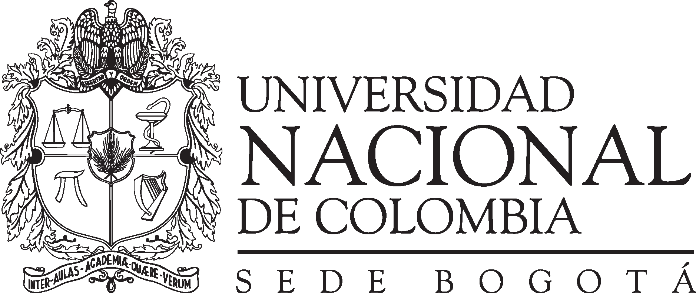

## {background-color="#0d1b2a"}

::: {style="text-align:center; color:#ffffff; margin-top:10%;"}
{width="38%" style="filter: invert(1) brightness(1.8);"}

 

**Muestreo Estadístico** — Universidad Nacional de Colombia

© 2026 Giovany Babativa-Márquez, PhD. Todos los derechos reservados.

Material elaborado con fines académicos para el curso de Muestreo
Estadístico. Se basa principalmente en Särndal, C.-E., Swensson, B. &
Wretman, J. (1992). *Model Assisted Survey Sampling*. Springer.
Prohibida su reproducción total o parcial con fines comerciales sin
autorización expresa del autor.

:::
